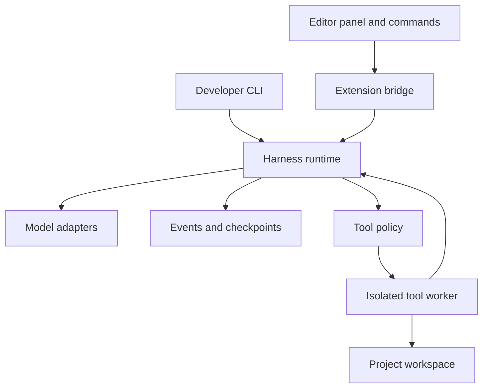

# KUR3 Harness: Master Build Guide

Version: 0.2 planning handoff  
Prepared: 2026-09-21  
Owner: KUR3  
Audience: human developers and coding assistants, including Grok, Claude, Kimi, and other reasoning models  
Status: proposed specification; no implementation or performance claims are implied

## 1. Start here

Build an open source AI coding harness that can run through a VS Code extension and, if selected, inside our own Code OSS desktop editor. Keep the engine independent of the editor so the product can evolve without rewriting its core.

A model is the engine. The harness provides the controls, tools, memory, and checks. The editor is the dashboard and workspace. API models execute at their providers; this project sends requests and executes authorized tools. Hosting a local model is an optional, separate concern.

This document combines the original harness plan with the proposed VS Code integration. It is detailed enough to organize implementation, but unresolved product choices are labeled explicitly. It does not authorize paid purchases, external publishing, destructive changes, or access to accounts.

### How KUR3 should use this file

1. Upload this file to a chosen model or add it to the project repository.
2. Use the kickoff prompt in Section 18.
3. Give the model one work package from Section 13, along with the relevant source files.
4. Review its code and actual check results. If it cannot run code, treat its output as unverified.
5. Save its handoff in the repository before switching models.
6. Give the next model the current repository state, decision log, and handoff. Do not rely on separate chat histories being shared.

You can use free chat access to draft and review code manually. That does not establish free API access or the ability to execute tools. Do not assume a model supports native tool calling because it supports reasoning. The harness must detect supported capabilities.

### What is established and what is proposed

| Item | Status | Working direction |
| --- | --- | --- |
| Own customizable harness | Requested | Public-source project suitable for GitHub |
| Build using different models | Requested | Portable assignments, checks, and handoffs |
| VS Code foundation | Requested exploration | Support an editor integration rather than build an editor from scratch |
| First shipping format | Unconfirmed | Recommend extension prototype; keep standalone fork path open |
| Main workflow | Unconfirmed | Default prototype: code edits with tests and a reviewable diff |
| Project name | Placeholder | KUR3 Harness |
| First API provider | Unconfirmed | Deterministic fake provider first, then one user-selected provider |
| Hardware and OS minimum | Unconfirmed | Ask exact OS and CPU architecture before promising compatibility |
| Monthly API budget | Unconfirmed | No paid live calls until credentials and spending scope are supplied |
| Commercial distribution and license | Unconfirmed | Record decision before release |

These defaults permit planning and an offline prototype. They are not claims that KUR3 selected every option.

## 2. Product goal and scope

The first useful experience is: open a project, describe a small change, select a model, run the task, inspect a diff and checks, and continue later without losing progress.

Target benefits:

- The user chooses the model provider and can change it at a clean task boundary.
- Progress survives interruptions and editor restarts.
- The user sees cost estimates, task limits, tool activity, and unfinished work.
- Completion is backed by explicit acceptance checks.
- Another model can continue from project facts and artifacts without the previous chat.

### First release includes

- One local project and one active run at a time.
- Plan and Run modes.
- Task brief, acceptance criteria, provider selection, and model capability validation.
- Streaming progress and a useful final result.
- Scoped file inspection and editing, followed by controlled command execution.
- Durable events, checkpoints, cancel, pause, and resume.
- Token accounting, estimated cost, limits, and bounded retries.
- A VS Code panel, native diff views, and a small command-line developer interface.
- Fake-provider examples and a second real provider before claiming provider portability.

### Later releases

Consider optional reviewer agents, concurrent tasks in separate workspaces, research tools, selected MCP servers, remote workers, a web dashboard, inline completion, and a branded Code OSS distribution. MCP is a standard way to connect external tools.

Do not put billing, teams, marketplaces, voice, training models, automatic model selection, or arbitrary computer control into the initial release. Models helping to build this repository are different from multiple agents executing inside the product.

## 3. Editor strategy

| Approach | Advantages | Work we own | Decision |
| --- | --- | --- | --- |
| VS Code extension | Reuses the installed editor; smaller distribution surface | Panel, commands, editor integration, extension compatibility | Recommended first prototype |
| Code OSS fork | Own application name, layout, installer, and deeper integration | Upstream updates, platform builds, packaging, signing, extension distribution | Optional product release path |
| Separate web dashboard | Useful for remote operation | Another interface, authentication, remote worker management | Defer unless remote access is the primary need |

Code OSS is the MIT-licensed source foundation of VS Code. The Microsoft distribution includes separate assets and services. A fork does not automatically get Microsoft branding, Marketplace access, or unrestricted use of every Microsoft extension. Consult the [official VS Code FAQ](https://code.visualstudio.com/docs/supporting/faq) before choosing distribution components.

For a fork, assess Open VSX or an explicitly licensed extension distribution mechanism. Verify individual extension availability and licenses. Do not promise that every extension will work.

The user can choose a standalone app first. In that case, keep the same independent runtime and embedded extension boundary, while adding the packaging milestone earlier. A fork remains additional work even when AI assists with it.

## 4. Open source foundations to evaluate

These are reference candidates, not proven winners. Prior repository review occurred on 2026-09-20, with Pi, Deep Agents, and the VS Code FAQ revisited on 2026-09-21. Popularity does not establish reliability. No hands-on comparison has been performed for this project.

| Candidate | What its documentation offers | Proposed use |
| --- | --- | --- |
| [Pi](https://github.com/earendil-works/pi) | Separate provider API and agent-runtime packages | Leading candidate for a compact TypeScript engine adapter |
| [Deep Agents](https://github.com/langchain-ai/deepagents) | Planning, context management, tools, memory, and delegation | Alternative if a more complete framework reduces our custom work |
| [LangGraph](https://github.com/langchain-ai/langgraph) | Persistent workflow execution and human intervention | Alternative when branching workflows become the main requirement |
| [OpenCode](https://github.com/anomalyco/opencode) | Coding agent and plan/build workflows | Product and interface reference |
| [OpenHands SDK](https://github.com/OpenHands/software-agent-sdk) | Agent runtime, workspaces, Agent Server, and clients | Alternative if isolated coding workspaces dominate the project |
| [OpenHands application](https://github.com/OpenHands/OpenHands) | Agent control interface across execution backends | Reference for workspace and task management |

Pi states that filesystem, process, network, and credential permissions are not restricted by a built-in permission system. Supply that boundary in our application. Deep Agents likewise places enforcement in tools and sandboxes. Do not assume a prompt provides isolation. See the linked repositories.

### Foundation selection gate

Before adopting a runtime, demonstrate the same small task using Pi and the relevant Deep Agents implementation. Compare adapter effort, cancellation, recoverable state, tooling boundaries, supported providers, dependency weight, and licensing. If access is unavailable, document the limitation and make the decision provisional.

Select one runtime implementation behind our interfaces. Do not run two competing loops or persist contradictory copies of authoritative state. Reuse upstream behavior where suitable and identify the owner of each retry, checkpoint, and permission decision.

Do not copy Cursor or Antigravity proprietary code, prompts, services, or branding. Their familiar editor experience is product inspiration.

## 5. Proposed architecture



Suggested stack: TypeScript for the runtime and extension, React only where it helps the panel, and SQLite for local state. Exact package versions and supported Node/editor versions must be verified and pinned by the builder. These are recommendations, not tested dependencies.

### Module ownership

| Module | Owns | Must not own |
| --- | --- | --- |
| Contracts | Runtime-validated schemas, protocol versions, shared types | Provider-specific network calls |
| Runtime | Run transitions, loop limits, coordination, checkpoints | Editor rendering |
| Providers | Provider-specific message conversion, streaming, usage, cancellation | Arbitrary tool execution |
| Policy | Tool eligibility, scopes, approval requirements | Model-generated permission changes |
| Worker | File and process execution within its declared boundary | Provider API credentials |
| Store | Transactions, events, artifacts, migrations | Unvalidated executable instructions |
| Verifier | Acceptance checks and evidence | Treating a model's confidence as a passing test |
| Extension | Editor context, UI bridge, secret access, diff display | A second independent agent loop |

Run the engine in a managed process so model activity does not freeze the editor. Use versioned process messaging for the initial local integration. If later using a local HTTP service, bind to loopback, authenticate requests, and avoid an exposed unauthenticated command service.

The tool worker is a separate boundary from the runtime process. Merely spawning a process or using a Git branch does not create a sandbox.

## 6. Repository layout

Suggested paths, all created during implementation:

| Path | Contents |
| --- | --- |
| `apps/vscode-extension/` | Activation, commands, panel, editor adapter |
| `apps/cli/` | Developer entry point and offline demo |
| `packages/contracts/` | Shared schemas and protocol |
| `packages/core/` | Runtime and selected upstream adapter |
| `packages/providers/` | Fake provider and real provider integrations |
| `packages/policy/` | Permissions and run limits |
| `packages/tools/` | Validated tool definitions |
| `packages/worker/` | Execution backends and cancellation |
| `packages/storage/` | SQLite schema, migrations, events, artifacts |
| `packages/evals/` | Fixtures and comparative evaluation runner |
| `tests/integration/` | End-to-end failure and recovery checks |
| `docs/decisions/` | Architecture decision records |
| `docs/handoffs/` | Handoffs from each builder |
| `docs/STATUS.md` | Current task status and next action |

Keep a Code OSS fork in its own repository if selected. It consumes a versioned harness build and a small documented integration patch. Avoid placing the entire upstream editor tree inside this application repository without a recorded reason.

Future root documents: `README.md`, `AGENTS.md`, `CONTRIBUTING.md`, `ACCEPTANCE.md`, `SECURITY.md`, and a chosen `LICENSE`. Preserve third-party notices. Use one package manager and lockfile.

## 7. Contracts and durable data

The following names are a proposed internal contract. They are not claims about any provider SDK. Finalize them in work package W01, validate at runtime, and version changes.

### Core entities

| Entity | Required information |
| --- | --- |
| Project | ID, canonical workspace root, isolation backend, policy reference |
| Task | Goal, scope, acceptance criteria, project ID |
| Run | Task ID, provider/model, state, limits, timestamps, parent run if any |
| Event | Schema version, run ID, monotonic sequence, type, timestamp, payload or artifact reference |
| ToolCall | Stable call ID, name, validated input, input digest, policy decision, lifecycle, result |
| Approval | Tool call/input digest, allowed scope, expiry, decision, decision source |
| Checkpoint | Run state, last event sequence, task facts, pending calls, workspace revision |
| Artifact | ID, path or storage reference, content hash, MIME type, producing event |
| Verification | Criterion, command/check, exit status, evidence, pass/fail/not-run |
| Usage | Request ID, provider/model, reported tokens, estimated cost, price version, completeness |

Persist runtime state outside the project so repository tools cannot silently rewrite it. Store artifact bytes separately from conversational context. Commit related state and event changes in one transaction. Use a single run lease to prevent two processes from resuming the same run simultaneously.

### Provider interface

Expose `capabilities()`, `stream(request, abortSignal)`, and usage/error normalization. Capabilities include native tools, structured output, streaming, input size, and supported reasoning controls.

Normalized stream events should cover text deltas, complete tool requests, usage updates, completion, and errors. Buffer incremental tool arguments until a complete validated request exists. Never execute partial JSON or text that merely resembles a command.

Represent unsupported capabilities explicitly. Do not send a generic reasoning parameter to every provider. Preserve provider continuation tokens or signed state as opaque provider-owned data, with appropriate retention, rather than attempting to interpret it.

### Tool interface

Each tool declares a name, input schema, read/write/external effect category, timeout, output limit, required permissions, and whether safe retry is supported. The executor returns a stable call ID, status, structured output, and evidence references.

Suggested first tools: `read_file`, `search_files`, `propose_patch`, `apply_patch`, and later `run_command`. Every path is checked against the canonical allowed root, including symlink and traversal cases. File reads must use the same worker boundary as writes.

Patch application requires the expected file hash. If a user or another process changed the file, return a conflict and recompute the patch. Never overwrite silently.

### Commands and events between the interface and engine

| Command | Expected behavior |
| --- | --- |
| `start_run` | Validate task, provider, mode, workspace, and limits before starting |
| `pause_run` | Stop scheduling new work; pause at a safe boundary |
| `cancel_run` | Abort requests and stop managed processes where supported |
| `resume_run` | Acquire run lease, reconcile pending calls, then continue |
| `decide_approval` | Apply decision only to the referenced input and scope |
| `get_run` | Return durable state independent of the panel's memory |
| `subscribe_events` | Continue after a sequence number without duplicate UI entries |
| `export_handoff` | Produce portable facts, artifact references, and remaining work |

Messages need request IDs, protocol versions, size limits, schema validation, and structured errors. A UI reconnect must not accidentally create another run.

## 8. Execution and recovery

### Run lifecycle

| State | Meaning and permitted progression |
| --- | --- |
| `queued` | Validated and waiting; may start or cancel |
| `running` | May execute within limits, request approval, pause, or finish |
| `waiting_for_approval` | No protected action runs until a matching approval exists |
| `paused` | Durable checkpoint; may resume or cancel |
| `completed` | Agent execution ended; verification has its own outcome |
| `failed` | Terminal error with recorded evidence |
| `canceled` | Stop requested and outstanding activity reconciled |
| `budget_exhausted` | No new billable work; an explicit budget update may allow continuation |

Verification is independently `passed`, `failed`, `not_run`, or `blocked`. Display "Completed, verification not run" when appropriate. A final model response is not proof of success. Failed or canceled runs can create a linked new run rather than rewriting history.

### Loop order

1. Check cancellation, elapsed time, remaining steps, capability support, and estimated budget.
2. Build context from trusted instructions, selected project facts, and bounded relevant artifacts.
3. Request the next model response and stream visible progress.
4. Normalize output. Validate each complete tool request against the schema.
5. Resolve policy. Persist intent and any approval decision before execution.
6. Execute one tool at a time in the initial release.
7. Persist output, usage, and checkpoint; return the tool result to the model.
8. Continue, run acceptance checks, or stop with a recorded reason.

An upstream runtime may implement parts of this sequence, but our required limits and tool boundary still apply.

### Recovery rules

- Tool calls progress through `prepared`, `running`, and a recorded terminal outcome. An interrupted call can become `outcome_unknown`.
- Inspect workspace state or query external status before retrying an unknown action. A file write can be reconciled using expected pre/post hashes.
- Read-only operations may retry only when declared safe. Never blindly repeat a publish, message, purchase, or other external mutation.
- Use stable idempotency keys where the receiving service supports them. Do not promise exactly-once external execution universally.
- After a crash, mark stale runs as interrupted and reconcile them before resuming. Do not run processes in the background simply because the UI restarted.
- Pause waits for a safe boundary. Cancel attempts active termination and reports any uncertainty. Neither guarantees undoing a completed side effect.
- Bounded provider retries apply to transient errors. Invalid credentials, denied permissions, malformed configuration, and unsupported features need correction.

Proposed development defaults: 30 tool steps, 15 minutes per run, 60 seconds per ordinary command, 2 transient retries, and stop after 3 identical failed actions. All are configuration proposals, not measured optimal limits.

## 9. Context, handoffs, and model switching

Maintain project instructions, current task, acceptance criteria, decisions, relevant file references, and recent tool evidence. Search before loading large files. Store large outputs as artifacts and send bounded excerpts with references.

When summarizing context, preserve the original permitted event history. A summary is a derived view and may omit details. Link decisions and verification claims to their evidence.

Switch models only after pending tool calls are resolved and a checkpoint exists. Convert portable messages and facts to the new provider's format. Do not forward another provider's opaque internal state or unsupported message types.

Portable handoffs include:

- Goal and current scope.
- Current repository revision and changed files.
- Decisions and their reasons.
- Completed acceptance checks with evidence.
- Remaining work, blockers, and known risks.
- Exact next action.

Request brief decision explanations from builders. Do not request or pretend to transfer private chain-of-thought. Reasoning controls are optional provider features; they do not replace tests.

## 10. Permissions, isolation, and spending

### Product permission rules

Plan mode permits scoped inspection and patch proposals. It cannot apply changes or execute arbitrary shell commands. Even commands called tests can execute project code, so command execution requires the Run-mode worker boundary.

Run mode uses explicit workspace and tool permissions. Ordinary authorized work should not trigger constant prompts. Bind any approval to the actual arguments and their scope. Changes to those arguments invalidate that approval.

Project files, websites, model output, and tool responses cannot grant themselves permission. Repository instructions may guide implementation but cannot elevate runtime access. Treat MCP servers as external executors that require their own approved scopes.

### Isolation stages

| Stage | Allowed behavior | Requirement |
| --- | --- | --- |
| Offline prototype | Fake responses and temporary test fixtures | No real shell tool or external mutations |
| File-edit prototype | Scoped reads and reviewed patches | Canonical paths, expected hashes, secret exclusions |
| Autonomous command mode | Run build/test commands | Validated worker isolation and documented mount/network policy |

Choose a worker backend for the actual supported OS. A restricted container or VM is a candidate, but its availability and overhead must be tested. Do not expose the host filesystem, runtime database, provider keys, or container management socket to the agent. Apply timeout, process, output, and network limits at the executor boundary. A command allowlist alone is not sufficient isolation.

If the chosen machine cannot support the selected worker, keep shell execution disabled and provide a clear manual-run workflow. Do not silently fall back to unrestricted host execution.

### Credentials and panel content

Use editor secret storage or an OS credential facility through a small credential interface. Retrieve keys only for authorized provider requests. Never put secrets in the panel, repository, prompt, fixture, trace, or exported handoff. Redact logs and exclude common secret files from default context collection.

Treat rendered model text as untrusted content. Disable arbitrary script execution, validate panel messages, and use a restrictive content policy. Opening an untrusted workspace must not launch tools automatically.

### Budget model

Reserve estimated input and maximum output cost before sending a request. Reconcile against reported usage afterward. Include provider-specific billed categories where available. Tag the pricing source and date. If prices or usage are unknown, display "unknown" rather than zero.

Stop new requests when the remaining budget cannot cover the reservation. In-flight work and uncertain billing can still exceed an estimate. Describe the feature as an estimated spending limit, not a guaranteed provider billing cap.

Default network tests are off. Live provider checks require explicitly supplied credentials and a small stated budget. Keep provider fees separate from the cost of using a chat assistant to develop this code.

## 11. Interface specification

Use the editor's existing file explorer, tabs, terminal display, and native diff views. Avoid building duplicates without a usability reason.

| Area | Content |
| --- | --- |
| Agent panel header | Project, provider, model, run state, estimated spend |
| Task composer | Goal, acceptance criteria, Plan/Run selector, workspace scope |
| Activity timeline | User-readable actions, tool status, expandable evidence |
| Controls | Start, pause/resume, cancel; approval controls only when needed |
| Result view | Summary, changed files, verification status, remaining issues |
| History | Saved runs, errors, checkpoints, export handoff |
| Settings | Provider credentials, model capabilities, limits, worker setup |

Required UI states: first launch, no provider, invalid credential, unsupported capability, running, waiting for approval, paused, network failure, context limit, budget exhausted, conflict, canceled, and completed with each verification outcome.

Support keyboard navigation, readable contrast, responsive panel widths, and text labels beyond colors. Show "Checking the fix" with expandable command evidence. Do not display invented thoughts or completion percentages.

Keep the previous proposal's standalone dashboard as an optional later interface. The initial implementation uses the editor integration described here.

## 12. Suggested development commands

The builder should implement these script names in the scaffold. They are desired interfaces, not commands that already work in an existing repository.

| Command | Purpose |
| --- | --- |
| `npm ci` | Install locked dependencies once a lockfile exists |
| `npm run build` | Build packages and editor integration |
| `npm run typecheck` | Check shared interfaces |
| `npm run lint` | Check formatting and code quality |
| `npm test` | Offline behavioral checks using fake providers |
| `npm run test:integration` | Persistence, recovery, tool policy, and bridge checks |
| `npm run demo:offline` | Reproducible task with no API key |
| `npm run test:live` | Explicitly enabled, budgeted real-provider checks |
| `npm run package:extension` | Produce an installable extension package |

Document prerequisites and exact tested OS/runtime versions. Prefer a maintained runtime that supports the selected environment. Never claim support for an older Intel Mac or macOS version without checking the chosen editor, runtime, and worker combination.

## 13. Work packages for other models

Implement one package at a time unless an integration owner explicitly assigns disjoint work. Each package should be small enough to finish and hand off. Split it further if context is limited.

| ID | Scope and dependencies | Deliverable | Exit check |
| --- | --- | --- | --- |
| W00 | Inspect environment and choices; none | Decision record, unresolved questions, confirmed prerequisites | Defaults clearly separated from owner decisions; no invented repository state |
| W01 | Shared contracts and scaffold; W00 | Package boundaries, schemas, run states, fake-provider fixture | Build/typecheck and schema validation pass offline |
| W02 | Runtime foundation spike; W01 | Pi/Deep Agents comparison and one selected adapter | Same bounded fake task demonstrates adapter compatibility; untested alternatives labeled |
| W03 | State storage; W01 | Schema, migration, events, checkpoints, run lease | Restart preserves ordered events; duplicate resume is rejected |
| W04 | Tool policy and file operations; W01 | Scoped file tools and conflict handling | Traversal/symlink escape blocked; stale patch conflicts; Plan cannot write |
| W05 | Integrated loop; W02-W04 | Single-run orchestration, limits, retry, pause/cancel | Offline task edits a fixture and records check evidence |
| W06 | First real provider; W05 | Streaming, native tools, errors, usage normalization | Mocked provider conformance passes; live smoke test only if enabled |
| W07 | Editor integration; W05 | Panel, bridge, native diff, history, credential interface | Offline demo works inside editor; reconnect does not duplicate a run |
| W08 | Isolated command worker; W04-W05 | Chosen backend, environment boundary, process cleanup | Command containment and cancel are demonstrated on supported OS |
| W09 | Recovery and budget hardening; W06-W08 | Unknown-outcome reconciliation, reservations, export | Crash and retry fixtures pass without blind duplicate writes |
| W10 | Second provider and switching; W09 | Second adapter and portable checkpoint conversion | Two providers meet the same contract; clean-boundary switch preserves task facts |
| W11 | Evaluation and release candidate; W10 | Evidence report, installable extension, docs | Clean install and acceptance matrix pass; limitations are published |
| W12 | Optional Code OSS distribution; owner selection plus stable core | Branded build, integration, update process | Editor launches harness; platform install and update path tested |

Default current status: W00 through W12 are not started. Writing this guide does not complete an implementation milestone.

### Assignment rules

Each task must name allowed files, dependencies, acceptance IDs, and exclusions. Changes to shared contracts require a recorded integration decision and updated consumers. Do not ask multiple builders to edit the same interface independently.

Grok, Claude, Kimi, or another capable model can fill any role. Assign by demonstrated output, context budget, and available tools, not an unsupported model ranking. A separate review pass is useful after implementation, but it is not a substitute for executing checks.

## 14. Acceptance matrix

These are required behaviors for the relevant milestones, not tests already executed.

| ID | Scenario | Passing evidence |
| --- | --- | --- |
| A01 | Offline startup | Demo completes with network disabled and no real API key |
| A02 | Basic task | Requested fixture change exists; expected acceptance check passes |
| A03 | Plan mode | Edit and arbitrary command requests are rejected without filesystem changes |
| A04 | Path boundary | Traversal, symlink escape, and non-workspace access are denied |
| A05 | Concurrent edit | Patch with stale file hash returns a conflict and preserves newer content |
| A06 | Credential handling | Seeded fake secret is absent from logs, exported context, and panel payloads |
| A07 | Malformed tool output | Incomplete or invalid tool arguments never execute |
| A08 | Retry limit | Simulated transient failure stops at configured limit with clear error |
| A09 | Pause | No new tool starts after pause boundary; restart can recover checkpoint |
| A10 | Cancel | Managed process and request terminate or show explicit uncertain status |
| A11 | Crash during write | Recovery reconciles actual file content before deciding to retry |
| A12 | Duplicate resume | Only one runtime can acquire the active run lease |
| A13 | Budget | Insufficient reservation prevents another request; unknown cost is labeled |
| A14 | Verification truth | Failing or unrun checks are never shown as passed |
| A15 | Model switch | Goal, decisions, artifacts, and checks survive provider change |
| A16 | Editor reconnect | History resumes from event sequence without duplicate task execution |
| A17 | Worker containment | Test workload cannot access denied files, credentials, or network destinations |
| A18 | Prompt injection | A malicious repository instruction cannot elevate permission or leak the seeded secret |
| A19 | Clean installation | Another clean environment can reproduce documented offline demo |
| A20 | Provider failure | Auth, rate-limit, timeout, and capability errors get distinct useful messages |

Use temporary fixtures and fake secrets. Keep live API tests optional and tightly scoped. Focus tests on behavior and failure boundaries rather than assertions that merely repeat implementation details.

## 15. How we decide whether this is better

Start with five representative tasks and expand to twenty when the product workflow is stable. Compare against the closest existing harness using the same model version, repository snapshots, available tools, budgets, and time limits.

Record completion rate against predefined checks, cost per successful task, elapsed time, user interventions, recovery success, and duplicate or unauthorized actions. Repeat trials and retain raw permitted results. Record environment and configuration so the comparison can be reproduced.

Evaluate custom features separately where possible. For example, compare recovery enabled versus disabled. Report tradeoffs rather than a single inflated score. Only describe the product as better for the task classes supported by measured evidence.

## 16. Standalone Code OSS release checklist

If KUR3 selects the fork route:

1. Select and pin an upstream Code OSS revision; document the supported platform matrix.
2. Use our own name, identifiers, icons, and product configuration.
3. Bundle the versioned harness integration and verify it without proprietary backend dependencies.
4. Choose a compatible extension distribution mechanism and audit required extension licenses.
5. Keep a small patch set and document the upstream merge process.
6. Build and smoke-test installers on each claimed platform. For macOS distribution, document signing and notarization requirements and who owns the credentials.
7. Implement and test updates, migration, rollback, and crash diagnostics without collecting source code or secrets by default.
8. Publish supported versions, notices, installation instructions, and known limitations.

An unsigned development build is not evidence of a production-ready public release. Do not claim all-platform support from a build tested on one operating system.

## 17. Work tracking and handoff templates

Create `docs/STATUS.md` during implementation with one row per work package:

| Task | Status | Owner/session | Base revision | Evidence | Next action |
| --- | --- | --- | --- | --- | --- |
| W00 | Not started | Unassigned | Not available | None | Inspect environment and record assumptions |

Allowed statuses: not started, in progress, blocked, ready for review, verified complete. Ready for review means code is available; verified complete requires recorded acceptance evidence.

### Builder handoff template

```text
Task ID:
Builder/model as reported by the interface:
Date:
Base commit or supplied source snapshot:
Resulting commit or patch reference:

Objective:
Files changed:
Interfaces changed:
Decisions and reasons:

Checks actually executed:
- Command:
- Environment:
- Result and relevant output:

Checks not executed and why:
Acceptance IDs satisfied:
Known limitations:
Uncommitted or conflicting work:
Remaining tasks:
Exact next action:
Files the next model needs:
```

Never invent a commit hash, execution result, benchmark, dependency version, or model identity. Say "not available" or "not run" where appropriate.

### Architecture decision template

```text
Decision ID and date:
Question:
Options considered:
Chosen option or provisional default:
Evidence:
Tradeoffs:
Affected contracts and modules:
Revisit trigger:
Owner decision required, if any:
```

## 18. Copy-paste prompts

These prompts work with any model that can read the supplied files. They do not assume paid features, terminal access, repository access, or hidden shared memory.

### A. Kickoff

```text
You are helping build KUR3 Harness. Read the attached
KUR3-Harness-Master-Build-Guide.md before proposing code.

Our goal is an independent agent engine with a VS Code integration and an
optional standalone Code OSS distribution. Treat unconfirmed choices as
provisional. Do not invent approvals or project progress.

Start with W00 only. Identify the workspace and existing source you can
actually access. If no source exists, say so. Separate verified facts,
proposed defaults, and questions that materially affect implementation.
Do useful offline planning without waiting for optional preferences.

Report your tools and limitations. If you cannot browse, mark dependency
and SDK details for verification. If you cannot execute code, do not claim
tests passed. End with a small W01 assignment and the handoff template.
Do not build the entire product in one answer.
```

### B. Implement one work package

```text
Read the master guide, current docs/STATUS.md, relevant decision records,
latest handoff, and the actual files for this task.

Task ID: [Wxx]
Objective: [one concrete deliverable]
Allowed files: [paths]
Dependencies already verified: [task IDs and evidence]
Acceptance checks: [Axx IDs and any task-specific checks]
Excluded work: [features or files outside scope]

Implement the smallest complete change that satisfies the objective.
Respect shared contracts and preserve unrelated changes. Do not bypass
permissions, isolation, budget limits, or failing checks to make progress.
Do not add services or credentials that this task does not require.

Use verified library APIs. Run relevant checks if tools are available.
Report exactly what ran. If execution is unavailable, provide a unified
diff against the supplied snapshot or complete new files, with precise
paths and commands for verification. Mark the result unverified.

Update status and produce a handoff. Stop at a coherent task boundary.
```

### C. Independent review

```text
Review task [Wxx] using the master guide, the supplied diff, current source,
and claimed test evidence. Do not assume the implementation is correct.

Check contract consistency, acceptance criteria, failure recovery,
workspace access, secrets, cancellation, and budget handling when relevant.
Look for unsupported claims and hidden behavior changes.

Return actionable findings with severity, file/symbol, reproduction or
reasoning summary, and a suggested correction. Distinguish confirmed bugs
from questions and untested risks. Do not rewrite the architecture unless
a concrete requirement makes it necessary. If no issues are found, state
the scope and limitations of the review rather than promising correctness.
```

### D. Resume with another model

```text
Continue KUR3 Harness from the attached master guide and latest handoff.
You do not have the previous model's private chat history.

Verify the supplied source revision and current files. Reconcile any
differences with the handoff before editing. Summarize the established
decisions in five bullets or fewer, identify the next incomplete work
package, and work only within its allowed scope.

Preserve verified behavior. Do not restart the project or substitute a
new framework merely because it is familiar. Record any necessary design
change with evidence and update affected interfaces. Finish with a new
handoff and truthful check results.
```

### E. When the model has limited context

```text
Work on only the assigned subtask. Ask for specific missing files instead
of guessing their contents. Reserve space to provide a handoff.

If the subtask cannot fit, divide it at an interface boundary and finish
one part. Keep the patch self-contained and identify exactly what remains.
Never label incomplete or untested work as finished.
```

## 19. Questions that shape the next revision

Ask these when relevant, not as a repetitive questionnaire before every task:

1. Is the first release a VS Code extension or a standalone branded editor?
2. Which exact operating systems and CPU architectures must work?
3. What is one real coding task the first prototype must complete?
4. Which provider credentials can be used, and what is the testing budget?
5. Which actions may run automatically, and which need a scoped approval?
6. Is the first audience KUR3 alone, a small group, or public users?
7. What existing-tool frustration should this product solve best?

The builder can proceed with fake providers, shared contracts, and an offline demo while these remain open. Do not silently turn provisional defaults into confirmed owner requirements.

## 20. Source and claim notes

Primary sources supporting external product descriptions are linked beside those descriptions in Sections 3 and 4. The original planning draft is KUR3-Harness-Plan-v0.1.md, dated 2026-09-20. This guide adds the editor integration strategy and implementation handoff structure.

Everything labeled proposed, suggested, default, milestone, interface, or acceptance criterion is a design recommendation for this project. It has not been implemented or benchmarked by preparing this document. Provider model names, API pricing, free tiers, package names, supported operating systems, and third-party licenses must be verified against current official documentation at implementation time.

The first concrete implementation outcome should be an offline task that opens in the editor, produces a controlled change, records evidence, and resumes from saved state. Build outward from that working core.
